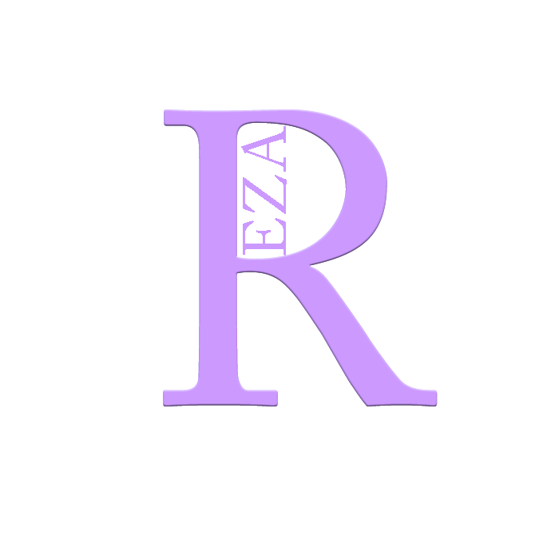

  
  

  <h1>Rzea GhaziKhani</h1>
  <h4>Website :‌ <a href="https://rezaghazikhani.ir">Rezaghazikhani.ir<a/></h4>
  

<h1>Skills <h1/>
      
      
        
      
        
        
        
  

<h1>My social networks <h1/>

  
        

